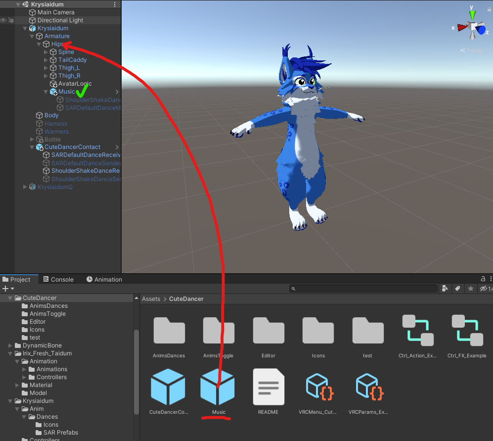
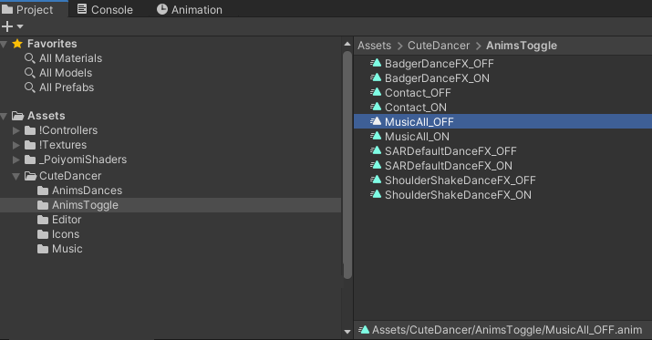
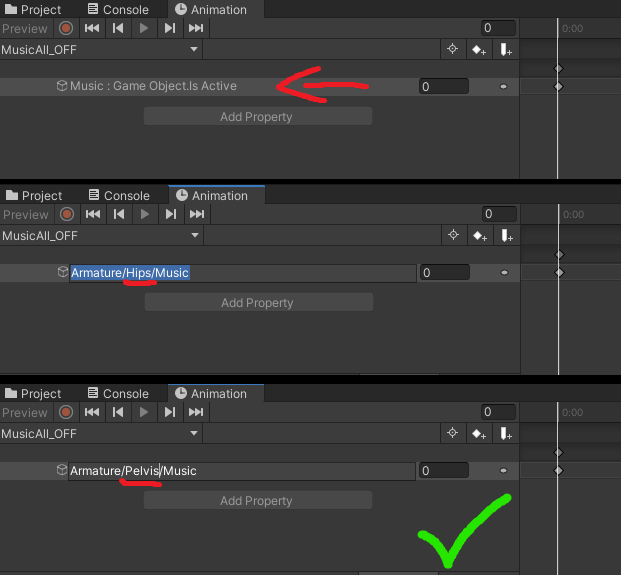
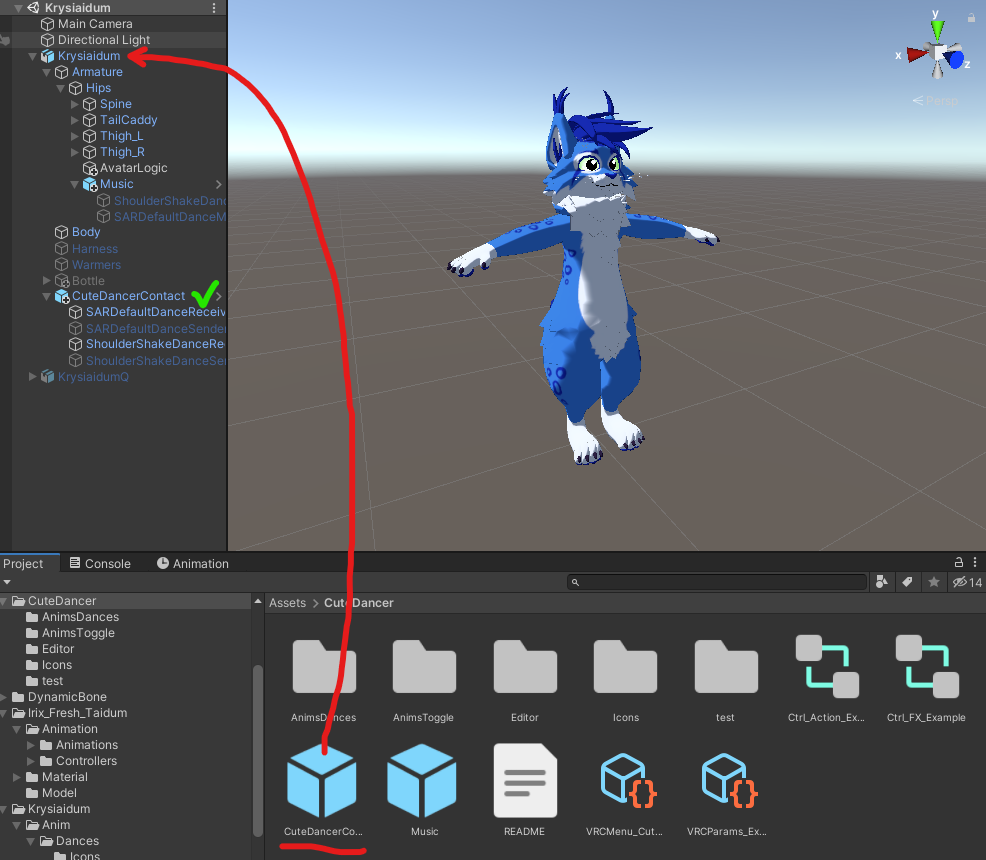
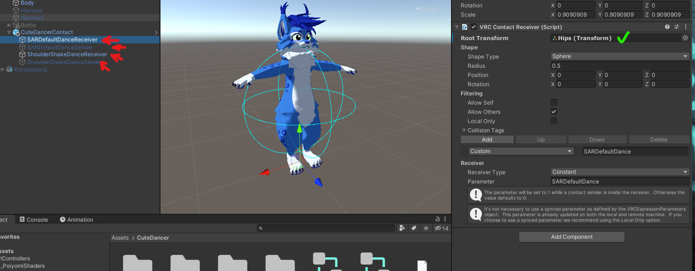
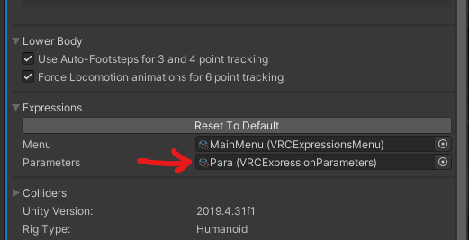
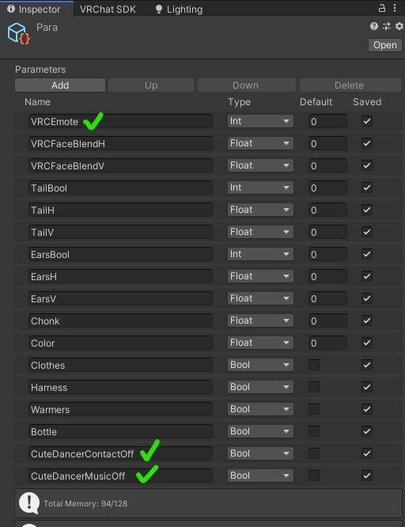
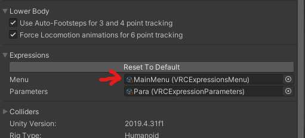
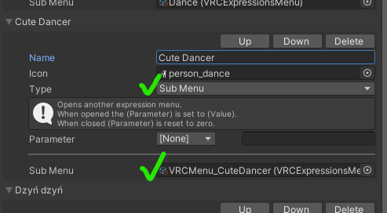
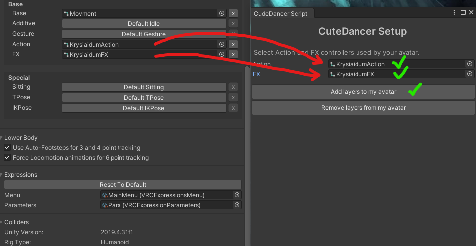

# **CuteDancer**

_Animacje, paczka: [Krysiek](https://github.com/Krysiek)  
Konfiguracja Sender/Receiver, wsparcie i testy: [Luc4r](https://github.com/Luc4r)  
Optymalizacja animatorów, testy: [Jack'lul](https://github.com/jacklul)_

[🇬🇧 For English - click here](/README.md)

## Opis CuteDancer

CuteDancer jest paczką .unitypackage dedykowaną dla avatarów [VRChat](https://hello.vrchat.com/). Zawiera animacje tańców, które mogą być odgrywane równocześnie z innymi graczami mającymi tę paczkę zainstalowaną na swoich avatarach.

### Jak to działa?

Dzięki komponentom `contacts` możliwe jest wysyłanie sygnałów między avatarami. Gdy jeden avatar zaczyna tańczyć, aktywowany jest odpowiedni `sender`, a `receiver` na avatarze innych graczy aktywuje daną animację. Istnieje możliwość wyłączenia `receiver`a w razie potrzeby.

### Załączone animacje

Na ten moment paczka zawiera 3 tańce:
- SAR Dance - domyślny taniec z gry [Super Animal Royale](https://animalroyale.com/)
- Coincidance - taniec potrząsania barkiem (z memicznego teledysku)
- Badger badger - taniec wzorowany klasyczną animacją flashową

Wszystkie powyższe animacje stworzył od podstaw [Krysiek](https://github.com/Krysiek) przy użyciu programu [Cascadeur](https://cascadeur.com/).  
Stworzone na bazie modelu Taiduma, ale będą również działać na innych avatarach.

## Pobieranie

[Pobierz najnowszą wersję tutaj](https://github.com/Krysiek/CuteDancer/releases)

## Instalacja

### 1. Zaimportuj paczkę do [Unity](https://unity.com/)

Przeciągnij pobrany plik `CuteDancer.unitypackage` do Unity lub wybierz z menu `Assets` -> `Import package` -> `Custom package...`

Wszystkie potrzebne pliki będą znajdowały się w katalogu `CuteDancer` w głównym folderze `Assets`.

### 2. Prefab `Music` przenieś do `[Avatar]` -> `Armature` -> `Hips`
- Jeśli Twój avatar nie ma kości `Hips`, przenieś prefab `Music` na jej odpowiednik (pierwsze dziecko obiektu `Armature`) - to będzie wymagało drobnych zmian w animacjach, ale więcej na ten temat w punkcie  [2. a.](#2-a-modyfikowanie-animacji)

### 2. a. Modyfikowanie animacji

_________________

🟡 **Ten krok jest opcjonalny - wykonaj instrukcję tylko jeśli `Hips` nie jest pierwszą kością wewnątrz obiektu `Armature`** 🟡

_________________

W przypadku, gdy Twój avatar korzysta z innej struktury wewnątrz obiektu `Armature`, **musisz** zmodyfikować część animacji, żeby cała paczka działała poprawnie.
- Otwórz folder `CuteDancer/AnimsToggle` (z głównego folderu `Assets`)
- Trzeba zaktualizować wszystkie animacje z tego folderu oprócz `Contact_ON`/`Contact_OFF`. Aby to zrobić:
    - Kliknij na wybraną animację - dla przykładu zacznijmy od `MusicAll_OFF`
    - Otwórz zakładkę `Animation` (jeśli jej nie widzisz, wybierz `Window` -> `Animation` -> `Animation` z górnego menu Unity)
    - Kliknij na tekst `Music : Game Object.Is Active`, a gdy się podświetli kliknij jeszcze raz - po ~sekundzie powinien zmienić się na pole tekstowe, które zawiera ścieżkę do brakującego obiektu (`Armature/Hips/Music`). Podmień `Hips` na pierwszą kość obiektu `Armature` w Twoim avatarze
    - Gotowe, ta animacja powinna już działać! Teraz powtórz te same kroki dla pozostałych animacji z tego folderu (`MusicAll_ON` będzie wymagało dokładnie takich samych kroków, a w pozostałych animacjach mamy dwie wartości zamiast jednej - `...Music` i `...Sender` - nas interesują tylko te z końcówką `...Music`, bo tylko one zawierają część `Hips`, którą musisz podmienić) 

### 3. Prefab `CuteDancerContact` przenieś na swój główny obiekt `[Avatar]`

- Dla wszystkich receiverów i senderów ustaw `Root Transform` na `Hips` Twojego avatara (nie jest to wymagane, ale powinno poprawić działanie ze space moverem itp.)
    - Znowu - jeśli Twój avatar nie ma kości `Hips` wybierz pierwszą kość wewnątrz obiektu `Armature`

### 4. Wzorując się na `VRCParams_Example` dodaj do `VRC Expressions Parameters` używanego przez Twój avatar:

- `VRCEmote` (jeśli nie istnieje) z polem `Type` ustawionym na `Int`
- `CuteDancerContactOff` z polem `Type` ustawionym na `Bool`
- `CuteDancerMusicOff` z polem `Type` ustawionym na `Bool`

### 5. Użyj `VRCMenu_CuteDancer` jako submenu w `VRC Expressions Menu` używanym przez Twój avatar

### 6. Przenieś warstwy kontrolera `Action` i `FX` z przykładowych plików

Pliki z przykładem to `Ctrl_Action_Example` i `Ctrl_FX_Example`.

Warstwy możesz przenieść ręcznie używając `Ctrl+C` i `Ctrl+V` lub użyć do tego automatycznego skryptu zawartego w tej paczce.

_________________

🛑 **PAMIĘTAJ O ZROBIENIU KOPII ZAPASOWEJ SWOICH KONTROLERÓW ACTION I FX** 🛑

_________________

Wybierz z górnego menu Unity `Tools` -> `CuteDancer Setup`

Do pola `Action` przeciągnij kontroler `Action` używany przez Twój avatar.   
Do pola `FX` przeciągnij kontroler `FX` używany przez Twój avatar.

Możesz wybraż je z listy (w tym celu kliknij na okrągły przycisk po prawej stronie pola wyboru kontrolera) albo przeciągnać je z zakładki `Project`.

Kliknij `Add layers to my avatar`.

_________________

⚠️ Uwaga: Jeśli w przyszłości chcesz mieć możliwość usunięcia warstw (lub łatwiejszą aktualizację paczki) - nie zmieniaj ich nazw w swoich kontrolerach! ⚠️

_________________

### 7. Gotowe!

Wgraj avatar i tańcz razem z innymi :)
