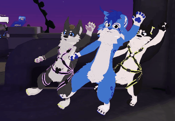

# **CuteDancer**

_Animacje, paczka: [Krysiek](https://github.com/Krysiek)  
Konfiguracja Sender/Receiver, wsparcie i testy: [Luc4r](https://github.com/Luc4r)  
Optymalizacja animatorów, testy: [Jack'lul](https://github.com/jacklul)_

[🇬🇧 For English - click here](/README.md)

## Opis CuteDancer

CuteDancer jest paczką .unitypackage dedykowaną dla avatarów [VRChat](https://hello.vrchat.com/). Zawiera animacje tańców, które mogą być odgrywane równocześnie z innymi graczami mającymi tę paczkę zainstalowaną na swoich avatarach.

### Jak to działa?

Dzięki komponentom `contacts` możliwe jest wysyłanie sygnałów między avatarami. Gdy jeden avatar zaczyna tańczyć, aktywowany jest odpowiedni `sender`, a `receiver` na avatarze innych graczy aktywuje daną animację. Istnieje możliwość wyłączenia `receiver`a w razie potrzeby.

### Załączone animacje

Na ten moment paczka zawiera 4 tańce:
- SAR Dance - domyślny taniec z gry [Super Animal Royale](https://animalroyale.com/)
- Coincidance - taniec potrząsania barkiem (z memicznego teledysku)
- Badger badger - taniec wzorowany klasyczną animacją flashową
- Zufolo Impazzito - taniec wzorowany [tym memem](https://www.reddit.com/r/doodoofard/comments/w6lhnl/dance/)

Wszystkie powyższe animacje stworzył od podstaw [Krysiek](https://github.com/Krysiek) przy użyciu programu [Cascadeur](https://cascadeur.com/) lub [Blender](https://www.blender.org/).  
Stworzone na bazie modelu Taiduma, ale będą również działać na innych avatarach.

## Pobieranie

[Pobierz najnowszą wersję tutaj](https://github.com/Krysiek/CuteDancer/releases)

## Instalacja

Poniższy film przedstawia typową instalację dla 3 różnych przypadków. Szczegółowa instrukcja pod filmem.

https://user-images.githubusercontent.com/54168895/182499824-b87969a1-47ed-4541-a98c-be268e594142.mp4

### 1. **Zaimportuj paczkę do [Unity](https://unity.com/)**

Przeciągnij i upuść plik `CuteDancer.unitypackage` do Unity albo wybierz z górnego menu: `Assets` -> `Import package` -> `Custom package...`

Wszystkie potrzebne pliki znajdziesz w katalogu `CuteDancer` w głównym folderze `Assets`.

### 2. **Otwórz okno `CuteDancer Setup`**

Wybierz z górnego menu Unity: `Tools` -> `CuteDancer Setup`.

Okno `CuteDancer Script` pomoże Ci zautomatyzować pewne nudne czynności oraz pozwoli zweryfikować, czy paczka została zainstalowana poprawnie.\*
___
_\* Nawet jeśli nie chcesz korzystać ze skryptu, który "robi magię", to wciąż możesz użyć go żeby sprawdzić, czy paczka została dodana poprawnie. Instrukcja instalacji ręcznej dla zaawansowanych użytkowników [jest tutaj](docs/README.old.md)._
___

### 3. **Wybierz twój avatar w oknie `CuteDancer Script`**

Przeciągnij i upuść avatar ze sceny lub kliknij kółko po prawej stronie pola i wybierz avatar z listy.

### 4. **Kliknij przycisk `Add` w każdej z sekcji**

Kliknij kolejno:
- `Add prefabs`
- `Add expression parameters`
- `Add expression submenu`
- `Add animator layers`
___
ℹ️ Jeśli twój avatar nie posiada expression parameters, expression menu albo wymaganych animatorów, zobaczysz okno z pytaniem, czy chcesz utworzyć brakujący asset. W takim przypadku kliknij `Create it` i pamiętaj o zapisaniu projektu. ℹ️
___
ℹ️ Informacja o backupie: każda operacja modyfikująca assety tworzy kopię pliku przed modyfikacją raz w ciągu dnia. Pliki te znajdziesz obok oryginalnych plików. ℹ️
___

### 5. **Gotowe!**

Wgraj swój avatar i tańcz razem z przyjaciółmi :)

## Aktualizowanie paczki

Jeżeli aktualizujesz `CuteDancer` z wersji 1.1 lub starszej, usuń katalog `CuteDancer` z Assetów. Następnie usuń wszystkie brakujące prefaby na avatarze (status missing). Następnie zainstaluj paczkę według instrukcji powyżej.
