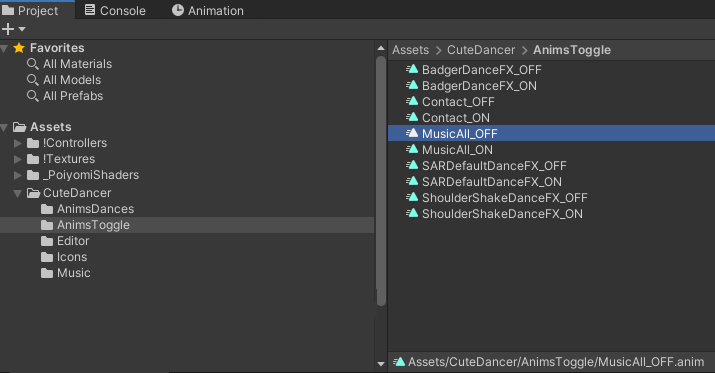
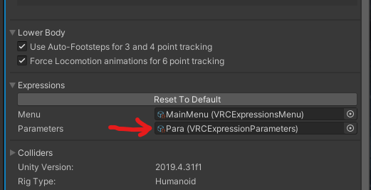
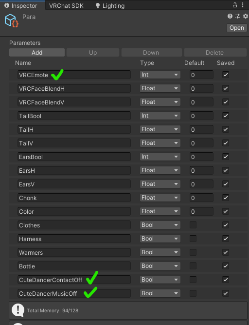
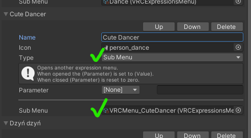

# **CuteDancer - Manual installation**
_________________
⚠️ Some images in this manual may be outdated! ⚠️
_________________

## Manual installation

### 1. Import package to [Unity](https://unity.com/)

Drag & drop `CuteDancer.unitypackage` file to Unity editor or select from Unity's top menu: `Assets` -> `Import package` -> `Custom package...`

All necessary files will be placed in the `CuteDancer` directory in your main `Assets` folder.

### 2. Drag & drop `CuteDancerMusic` prefab on your main `[Avatar]` object

### 2.a. Modyfing animations
_________________
🟡 **This step is optional, proceed if your first bone under `Armature` is different than `Hips`** 🟡
_________________

If you want to change placement of the prefab in the hierarchy, e.g. place it under a bone or inside another object, you **have to** update some animations in the `AnimsToggle` directory for the package to work.

- Open `CuteDancer/AnimsToggle` folder (from your main `Assets` folder)
- All animations but `Contact_ON`/`Contact_OFF` need to be updated.
    - Let's start with `MusicAll_OFF` animation - click on it
    - Open the `Animation` tab (in case you don't see it select `Window` -> `Animation` -> `Animation` from Unity's top menu)
    - Click on the `CuteDancerMusic : Game Object.Is Active` label and then press `F2` key - it should switch to the text field which contains path to the missing object (`CuteDancerMusic`). Add path to the new placement of the prefab before `CuteDancerMusic` separating them with `/`. Example: if you moved the prefab to `Armature -> Hips`, you have to change `CuteDancerMusic` to `Armature/Hips/CuteDancerMusic`.
    - Done, this animation should work properly! Now repeat these steps for other animations from this folder (`MusicAll_ON` will be the exact same steps, for other animations there are two fields - `...Music` and `...Sender` - you only need to update `...Music` one since it contains `Hips` part which you need to replace)

### 3. Drag & drop `CuteDancerContact` prefab on your main `[Avatar]` object

- For all receivers and senders, you can set `Root Transform` to `Hips` - it is not necessary, but it should work better with space movers etc.

### 4. Add new parameters to your `VRC Expressions Parameters`:

- `VRCEmote` (if doesn't exist) with `Type` set to `Int`
- `CuteDancerContactOff`, with `Type` set to `Bool`
- `CuteDancerMusicOff`, with `Type` set to `Bool`

You can check out the `VRCParams_Example` file as an example.

### 5. Use `VRCMenu_CuteDancer` as a submenu in your `VRC Expressions Menu`

### 6. Transfer layers to `Action` and `FX` controllers from example files

Example controllers are named accordingly: `Ctrl_Action_Example` and `Ctrl_FX_Example`.

### 7. **Finished!**

Upload the avatar and enjoy dancing with your friends :)
